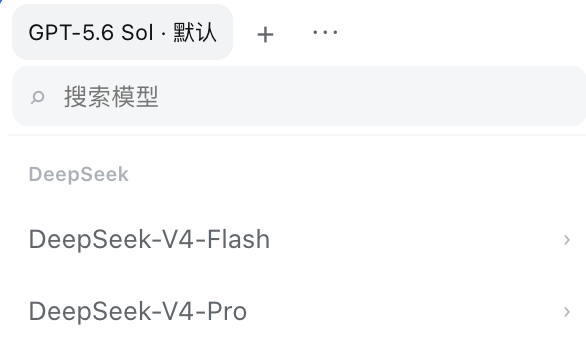

# DSH Model Presets

English | [中文](README.md)



Save frequently used **model + reasoning effort** combinations in the DeepSeek Harness model menu and switch them with one click.

## Features

- Saves frequently used model and reasoning-effort combinations.
- Switches presets from the top of the model list with one click.
- Adds, renames, reorders, and deletes presets.
- Searches available models.
- Switches the first nine presets with `Alt/Option + 1–9`; shortcuts stay inactive while typing.
- Keeps presets after Harness restarts with browser-local persistence.

Each preset records the API provider, model, and reasoning effort used when it was saved. The same model on two providers remains two separate combinations. If a provider or model becomes unavailable, its preset dims and stops responding; it returns to normal when the provider or model comes back.

## Install

```sh
dsh plugin --profile web add https://github.com/Zding89/dsh-model-presets
```

Restart DSH Web after installation. Once listed, it will also be available from DSH's **Plugin Market**.

## Use

1. Open the model selector at the bottom of the composer.
2. Pick a model and reasoning effort.
3. Select `+` at the top to save the current combination.
4. Select a preset name to switch immediately.
5. Select `⋯` to rename, reorder, or delete presets.

On first use, the current combination is saved as the first preset. If you delete every preset, it will not be added again.

## Data and privacy

Presets stay in the current browser and are never uploaded. They do not sync across browsers, devices, or addresses. Up to 50 presets are stored.

## Compatibility

- DeepSeek Harness `0.1.0-rc.7` or a compatible newer release.
- Uses DSH's built-in `modelDirectories` service and `conversation.input.model` Slot.
- The current release targets the Web profile.

## Development

The browser bundle is included in the repository, so installation needs no local build.

```sh
npm run check
```

## Uninstall

```sh
dsh plugin --profile web remove dsh-model-presets
```

Restart DSH Web afterward. Uninstalling does not clear presets already stored by the browser.

## License

MIT
